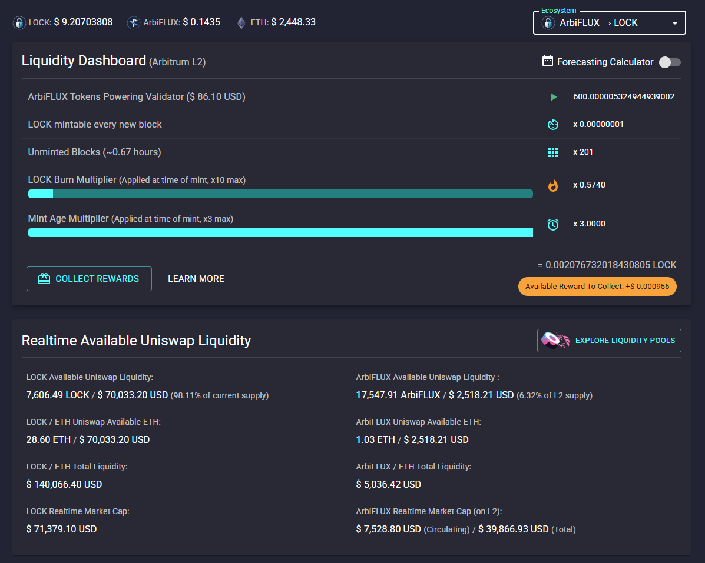

_Preface: For true decentralization and openness we've decided to open source 6 years of work for Datamine Network dApp. We believe this will close another gap of centralization and bring us closer to true vision of DeFi._ 🔮

[](https://opensource.org/licenses/MIT)
[](https://react.dev/)
[](https://www.typescriptlang.org/)
[](https://vitejs.dev/)
[](https://mui.com/)
[](https://web3js.org/)
[](https://yarnpkg.com/)
[](https://github.com/Datamine-Crypto/dashboard)
[](https://github.com/Datamine-Crypto/dashboard/actions/workflows/deploy.yml)
[](https://nodejs.org/)
[](https://discord.gg/2dQ7XAB22u)

You can access the latest version of Datamine Realtime Decentralized Dashboard by clicking the following link:

<https://datamine-crypto.github.io/dashboard/>

# 🚀 Datamine Realtime Decentralized Dashboard

## Table of Contents

- 🚀 [Quick Start Guide](#-quick-start-guide)
- 🗺️ [Context Map: Datamine Network Knowledge Base](#️-context-map-datamine-network-knowledge-base)
- ✨ [Features](#-features)
- 🛠️ [Development](#️-development)
- 📸 [Screenshots](#-screenshots)
- 🤝 [Contributing](#-contributing)
- 🧪 [Testing Strategy](#-testing-strategy)
- 📚 [Learn More](#-learn-more)
- ❓ [Support](#-support)
- 📄 [License](#-license)

## 🚀 Quick Start Guide

This guide will help you get the Datamine Realtime Decentralized Dashboard up and running on your local machine.

### Prerequisites

To run this project locally, you will need to have Node.js and Yarn installed.

- **Node.js**: We recommend using Node.js v18 or higher. You can download it from [nodejs.org](https://nodejs.org/en/).
- **Yarn**: This project uses Yarn v4. You can install it globally via npm: `npm install -g yarn@^4.0.0`

### Installation

1.  **Clone the repository:**
    ```bash
    git clone https://github.com/Datamine-Crypto/dashboard.git
    ```
2.  **Navigate to the project directory:**
    ```bash
    cd dashboard
    ```
3.  **Install dependencies:**
    ```bash
    yarn install
    ```

### Running the Application

Once the dependencies are installed, you can start the development server:

```bash
yarn start
```

This will open the application in your browser at `https://localhost:3000`. The page will automatically reload if you make any code changes.

# 🗺️ Context Map: Datamine Network Knowledge Base

This map outlines the key concepts, components, and principles of the Datamine Network, serving as a shared knowledge base.

- **🌐 Datamine Network Overview**
  - **🎯 Purpose:** Web-based dashboard for interacting with Datamine smart contracts, viewing analytics, and managing assets across different blockchain layers.
  - **✨ Core Values & Principles:**
    - 💧 Transaction-incentivized Liquidity Pools
    - 🔥 On-Chain Linear Deflation (FLUX)
    - 📊 Realtime Multi-Smart Contract Analytics
    - 🔒 Secure By Design & Professionally Audited
    - 🤝 Built For The Community
    - 🌍 Global Problem Solved (Inflation)

- **🪙 Tokens**
  - **💰 DAM (Datamine Token)**
    - 🔢 Fixed Supply: 16,876,778 tokens
    - 📜 Standard: ERC-777
    - 💡 Primary Use: Staking to power validators
  - **⚡ FLUX (Flux Token)**
    - 📈 Supply: Non-fixed, linear and predictable deflation through burning
    - 💡 Primary Use: Base currency of the ecosystem, earned through minting
  - **🔵 ArbiFLUX**
    - 🔗 Layer: L2 (Arbitrum)
    - 💡 Primary Use: Combats gas costs of minting FLUX on L1
  - **🔐 LOCK (Lockquidity Token)**
    - 🎯 Purpose: Enhances stability, contributes to permanent liquidity pool
    - ⛏️ Minting: Minted by locking ArbiFLUX
    - 🔥 Burning Mechanism: Redirects value to liquidity pool (not supply reduction)
    - 📊 Market Efficiency: 100% - percentage of LOCK inside the market

- **⚙️ Core Mechanisms & Features**
  - **✅ Validator (Mint Start/Stop)**
    - 🔄 Process: Locking DAM tokens to generate FLUX
  - **🤝 Delegated Minting:** Allows another address to mint FLUX on behalf of a validator
  - **📱 Remote Minting/Burning:** Mint/burn FLUX from phone to any Ethereum address
  - **✂️ Partial Minting:** Specify percentage (0-100%) to mint smaller amounts
  - **⏳ Mint Age Multiplier:** Increases over time (up to 3x after 28 days) for continuous validator operation
  - **🔥 Burn Multiplier:** Variable (up to 10x) based on FLUX burned relative to global averages
  - **🛒 Datamine Market (Decentralized "Time-in-market" solution)**
    - 💡 Concept: Decentralizes "Time-in-market", creates decentralized demand
    - 🔄 Mechanism: Validators offer rewards for burning LOCK to their account (single ETH transaction)
  - **💎 Datamine Gems #GameFi**
    - 🎮 Concept: Real-time game to collect "gems" (public market addresses with unminted balances)
    - 🔄 Mechanism: Burning tokens, V2 Public Market smart contract, atomic batch burning, optimized reward distribution, "Collect all gems" button
    - 🎯 Goal: Increase monetary velocity and transactional throughput

- **🔗 Ecosystems & Layers**
  - **⛓️ Multi-chain Support:** Ethereum Mainnet (L1), Arbitrum (L2)
  - **🌳 Ecosystems Defined:**
    - DAM->FLUX (L1)
    - FLUX (L2)->ArbiFLUX (L2)
    - ArbiFLUX (L2)->LOCK (L2)
  - **⚙️ Configuration:** Managed in `src/configs/ecosystems/`

- **📜 Smart Contracts & ABIs**
  - **📍 Location:** `src/core/web3/abis/`
  - **🔑 Key Contracts:**
    - DAM Token (`dam.json`)
    - FLUX Token (`flux.json`)
    - Market Contract (`market.json`)
    - Uniswap V2 Router (`uniswapv2router.json`)
    - Uniswap Pair (`uniswapPair.json`)
    - Uniswap Pair V3 (`uniswapPairV3.json`)
    - Multicall (`multicall.json`)
  - **🛡️ Security Features:** SafeMath, Mutex, Checks-Effects-Interactions, Modifiers (`preventSameBlock()`, `requireLocked()`), Immutable State Variables, ERC-1820 ERC777TokensRecipient
  - **🛠️ Core Functions:** `lock()`, `unlock()`, `burnToAddress()`, `mintToAddress()`
  - **🔍 View-Only Functions (Analytics):** `getMintAmount()`, `getAddressTimeMultiplier()`, `getAddressBurnMultiplier()`, `getAddressRatio()`, `getGlobalRatio()`
  - **📦 Data Aggregation:** `getAddressDetails()`, `getAddressTokenDetails()`

- **🏗️ Application Architecture (High-Level)**
  - **🖥️ UI:** React components (`src/core/react/`)
  - **🔗 Blockchain Interaction:** Web3.js, Web3Bindings, Web3Context, web3Reducer (`src/core/web3/`)
  - **🧠 State Management:** `web3Reducer.ts` and `Web3Bindings.ts` (Commands & Queries pattern), `sideEffectReducer.ts`
  - **🔧 Utilities:** Helper functions (`src/core/utils/`)
  - **⚙️ Configuration:** `src/configs/`
  - **🎨 Styling:** `tss-react`, `useStyles`, Material-UI themes (`src/core/styles.ts`)
  - **🚨 Error Handling:** `src/core/web3/helpers.ts` (`rethrowWeb3Error`), `web3Reducer.ts` (error state), Material-UI Snackbars/Dialogs

- **🔌 Third-Party Integrations**
  - **📚 Help Articles:** Markdown files in `public/helpArticles/`, fetched via `fetch` API
  - **🔍 Search:** `fuse.js` for help articles

- **🛠️ Development & Deployment**
  - **🏗️ Build Tool:** Vite (`vite.config.mts`)
  - **📦 Package Manager:** Yarn
  - **📜 Scripts:** `yarn start`, `yarn build`, `yarn deploy`, `yarn format`, `yarn lint`
  - **💻 Local Development:** HTTPS via `vite-plugin-mkcert`
  - **🧹 Code Quality:** ESLint, Prettier, Husky, Lint-staged
  - **🚀 Deployment:** GitHub Pages (`.github/workflows/deploy.yml`, `package.json` homepage field)

## ✨ Features

- **Realtime Analytics**: Instant access to Datamine (DAM), FLUX, and on-chain Uniswap USD pricing. 📈
- **Multi-Ecosystem Support**: Seamlessly interact with different blockchain environments like Ethereum Mainnet (L1) and Arbitrum (L2). 🌐
- **Full Privacy Mode**: No analytics, tracking, cookies, external resources, or 3rd parties utilized. Your data stays yours! 🔒
- **No Installation Required**: Just drag & drop onto any local or remote web server. 🚀
- **IPFS, SWARM & TOR Compatible**: Move one step closer to true decentralization by hosting on Distributed Web. 🕸️
- **Decentralized Minting & Burning**: Tools to manage your DAM and FLUX tokens directly from the dashboard. 🔥
- **Comprehensive Help & Knowledgebase**: Integrated instant help desk for common questions. 📖

### Datamine Market (Decentralized "Time-in-market" solution)

A revolutionary approach to decentralize "Time-in-market" and create true decentralized demand. Validators can offer a percentage reward for others to burn LOCK to their account, effectively decentralizing demand and increasing market efficiency. This process is seamlessly executed in a single Ethereum transaction.

### Datamine Gems #GameFi

A real-time game where users collect "gems" (public market addresses with unminted balances) by burning tokens. It features a new V2 Public Market smart contract for even greater throughput, atomic batch burning from multiple addresses, and optimized reward distribution. A "Collect all gems" button allows for single-transaction collection from multiple addresses, aiming to increase monetary velocity and transactional throughput.

### LOCK (Lockquidity) Token

Our newest token, LOCK, is designed to enhance stability by contributing to a permanent liquidity pool. It is minted by locking ArbiFLUX. Uniquely, burning LOCK redirects value to the liquidity pool instead of reducing supply, ensuring long-term stability. A new metric, "Market Efficiency," is introduced, defined as 100% minus the percentage of LOCK inside the market. Higher market efficiency indicates more trading volatility and benefits validators.

### Core Values & Ecosystem Principles

The Datamine Network is built on core values that drive its unique approach to DeFi:

- **Transaction-incentivized Liquidity Pools:** DAM and FLUX offer unique incentives for providing liquidity on Uniswap & Balancer pools, ensuring constant token movement.
- **On-Chain Linear Deflation:** FLUX supply is non-fixed and features predictable deflation through a burning mechanism, with its generation tied to DAM staking.
- **Realtime Multi-Smart Contract Analytics:** The dashboard provides real-time on-chain market sentiment, balances in USD, and analytics through deep Uniswap integration.
- **Secure By Design & Professionally Audited:** All business logic is executed via audited smart contracts, ensuring fund safety and security without third-party involvement.
- **Built For The Community:** Utilizes serverless, web3, and mobile technologies for a seamless and secure user experience.
- **Global Problem Solved:** The Datamine Ecosystem aims to solve inflation through its deflationary tokenomics and on-chain demand generation.

### Token Specifications & Mechanics

The ecosystem comprises several tokens with distinct roles and mechanics:

- **DAM (Datamine Token):** Fixed supply (16,876,778 tokens), ERC-777 standard, primarily used for staking to power validators.
- **FLUX (Flux Token):** Non-fixed supply, base currency of the ecosystem, features linear and predictable deflation through burning.
- **Validator (Mint Start/Stop):** The process of locking DAM tokens to generate FLUX.
- **Delegated Minting:** Allows a different Ethereum address to mint FLUX tokens on behalf of a validator.
- **Remote Minting/Burning:** Features for minting FLUX from a phone to any Ethereum address, and burning FLUX to any address with an active mint.
- **Partial Minting:** Ability to specify a percentage of minting (0-100%) and mint smaller amounts to other addresses.
- **Mint Age Multiplier:** Increases over time (up to 3x after 28 days) for continuous validator operation.
- **Burn Multiplier:** Variable multiplier (up to 10x) based on FLUX burned relative to global averages.

### Smart Contracts - In-Depth Breakdown

The project's smart contracts are the backbone of the Datamine Network, built with a strong emphasis on security and transparency:

- **Technology Stack:** Smart contracts are written in Solidity (v0.6.9) and are ERC-777 compatible, built upon OpenZeppelin secure libraries.
- **Security Features:** Includes SafeMath for arithmetic operations, Mutex and Checks-Effects-Interactions Pattern for re-entrancy protection, custom modifiers (`preventSameBlock()`, `requireLocked()`), immutable state variables, and a unique ERC-1820 ERC777TokensRecipient implementation.
- **Core Functions:** Detailed explanation of `lock()`, `unlock()`, `burnToAddress()`, and `mintToAddress()` functions, including their security considerations and how they modify the contract's state.
- **View-Only Functions:** Functions like `getMintAmount()`, `getAddressTimeMultiplier()`, `getAddressBurnMultiplier()`, `getAddressRatio()`, and `getGlobalRatio()` provide real-time analytics without modifying state.
- **Data Aggregation:** Helper functions (`getAddressDetails()`, `getAddressTokenDetails()`) are provided to reduce network calls for dashboard data.
- **Additional Security Considerations (ConsenSys):** Adherence to best practices like preparing for failure, careful rollout, keeping contracts simple, staying up to date, awareness of blockchain properties, and secure development recommendations (external calls, public data, integer handling, assert/require/revert usage, modifiers, rounding, fallback functions, visibility, pragma locking, events, `tx.origin`, timestamp dependence, EIP20 approve/transferFrom attack).

## 🛠️ Development

### Available Scripts

In the project directory, you can run the following scripts:

- `yarn start`: Runs the app in development mode.
  Open [https://localhost:3000](https://localhost:3000) to view it in the browser.

The page will reload if you make edits.
You will also see any lint errors in the console.

- `yarn build`: Builds the app for production to the `build` folder.
- `yarn deploy`: Creates a production build with a specific base path for deployment.
- `yarn format`: Formats code using Prettier.
- `yarn lint`: Lints the project using ESLint.

### To Deploy

#### `yarn build`

This will create a new build in build/ folder that you can host. We currently host this on github(<https://datamine-crypto.github.io/dashboard/>) for decentralization reasons & proof of builds.

The `homepage` field in `package.json` is set to `.`, which is crucial for GitHub Pages deployments when the site is hosted in a subfolder (e.g., `your-username.github.io/your-repo-name/`). This ensures that relative paths for assets are correctly resolved.

The builds can be hosted in subfolders and do not perform external http calls for security & decentralization.

## 📸 Screenshots




## 🤝 Vibe Code Contribute

We welcome contributions from the community, and we're excited to introduce a new way to contribute that aligns with the "vibe coding" philosophy, powered by the Gemini CLI. This approach aims to streamline the development process, reduce friction, and allow you to focus on the creative aspects of building.

### What is "Vibe Coding"?

"Vibe coding" is about staying in a creative flow state, where the technical details and tedious tasks are handled by intelligent tools, allowing you to concentrate on the core problem-solving and innovation. With the Gemini CLI, you can interact with the codebase in a more intuitive and efficient manner.

### How to Contribute with Gemini CLI

1.  **Install Gemini CLI:** If you haven't already, install the Gemini CLI on your system. (Instructions for installation can be found in the Gemini CLI documentation).
2.  **Clone the Repository:**
    ```bash
    git clone https://github.com/Datamine-Crypto/dashboard.git
    ```
3.  **Start Vibe Coding:** Launch the Gemini CLI within your cloned repository. The CLI will act as your intelligent co-pilot, understanding your intent and executing complex tasks with simple commands.
    - **Intent-Driven Development:** Instead of manually navigating files and performing repetitive tasks, you can express your intentions directly to the CLI. For example:
      - "Add a new feature to the dashboard."
      - "Refactor this component for better performance."
      - "Fix this bug in the smart contract interaction."
      - "Update all help articles to include information about the LOCK token."
    - **Automated Code Generation & Modification:** The Gemini CLI can read, search, and modify code across the entire project. It can help you:
      - Generate new components or modules based on existing patterns.
      - Apply consistent styling changes across multiple files.
      - Perform complex refactoring operations with precision.
      - Ensure adherence to project conventions and best practices.
    - **Contextual Awareness:** The CLI maintains a deep understanding of the project's structure, dependencies, and coding style, ensuring that your contributions seamlessly integrate with the existing codebase.
4.  **Create a Pull Request:** Once you've completed your changes with the help of the Gemini CLI:
    - **Review Changes:** The CLI can help you review your changes and ensure everything is as expected.
    - **Commit with Clarity:** The CLI can assist in crafting clear and concise commit messages.
    - **Open a Pull Request:** Push your changes to your forked repository and open a pull request to the `main` branch.

### Why Vibe Code?

By leveraging the Gemini CLI, we aim to:

- **Reduce Friction:** Minimize the time spent on mundane tasks, allowing you to focus on innovation.
- **Accelerate Development:** Speed up the development cycle, bringing new features and improvements to the Datamine Network faster.
- **Improve Code Quality:** Ensure consistency and adherence to coding standards with automated assistance.
- **Foster Creativity:** Empower developers to stay in their creative flow, making contributions more enjoyable and impactful.

Join us in building the future of DeFi with a truly modern and efficient development experience. We look forward to your "vibe coded" contributions! 🙏

## 🧪 Testing Strategy

While comprehensive UI testing is valuable, our current focus prioritizes rapid UI experimentation. This approach is informed by:

- **Audited Smart Contracts**: Our core smart contracts have undergone thorough audits (see [`audits folder`](https://github.com/Datamine-Crypto/white-paper/tree/master/audits)), ensuring their reliability and security. This mitigates concerns about the underlying blockchain logic.
- **Direct MetaMask Communication**: The UI primarily communicates directly with MetaMask, acting as a thin client to immutable smart contracts. This reduces the complexity and risk typically associated with backend integrations.

Given these factors, we find it more efficient to iterate quickly on the UI, leveraging the stability of the audited contracts and the direct, secure wallet interaction. Future development may include UI tests as the project matures and UI stability becomes a higher priority.

## 📚 Learn More

You can learn more in the [Vite documentation](https://vite.dev/).

To learn React, check out the [React documentation](https://react.dev/).

## ❓ Support

If you have any questions, issues, or just want to connect with the community, please reach out through our:

- **Discord**: Join our [Discord server](https://discord.gg/2dQ7XAB22u) for real-time discussions and support. 💬
- **GitHub Issues**: For bug reports or feature requests, please open an issue on our [GitHub repository](https://github.com/Datamine-Crypto/dashboard/issues). 🐛

## 📄 License

This project is licensed under the MIT License - see the [LICENSE](LICENSE) file for details. ⚖️
