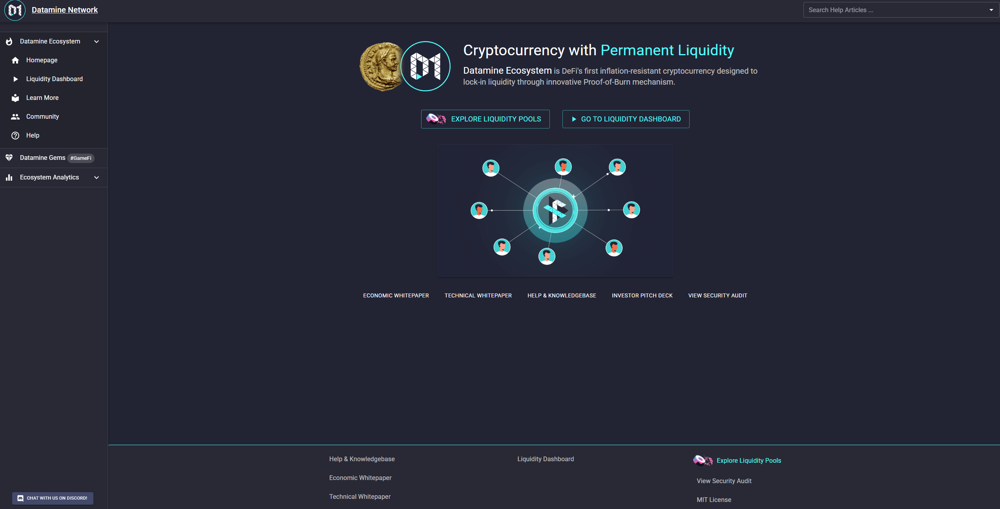
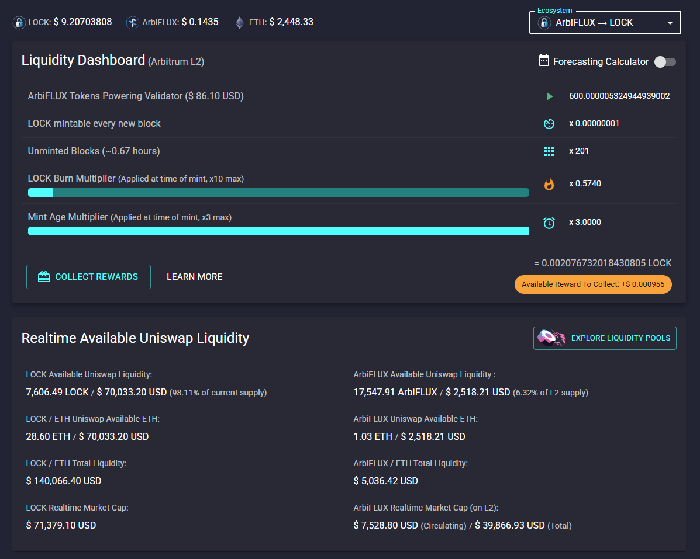

*Preface: For true decentralization and openness we've decided to open source 3 years of work for Datamine Network dApp. We believe this will close another gap of centralization and bring us closer to true vision of DeFi.* 🔮

You can access the latest version of Datamine Realtime Decentralized Dashboard by clicking the following link:

<https://datamine-crypto.github.io/realtime-decentralized-dashboard/>

# 🚀 Realtime Decentralized Dashboard

Welcome to the Datamine Network Dashboard! This project is a web-based dashboard for the Datamine Network, built with React and TypeScript. It provides users with tools to interact with Datamine smart contracts, view analytics, and manage their assets across different blockchain layers.

## ✨ Core Technologies

- **Framework:** React v19 ⚛️
- **UI Library:** Material-UI (MUI) v7 🎨
- **Blockchain Interaction:** Web3.js v4, @walletconnect/ethereum-provider 🔗
- **Language:** TypeScript 💻
- **Build Tool:** Vite ⚡
- **Package Manager:** Yarn v4 🧶

## 🏛️ Key Architectural Patterns

The `src` directory is organized with a clear separation of concerns:

- **`src/core/`**: Contains the application's core logic.
  - **`src/core/react/`**: Houses all React components, pages, and UI-related elements.
  - **`src/core/web3/`**: Manages all blockchain interactions, including Web3 provider setup, contract bindings, and ABI definitions (located in `src/core/web3/abis/`).
  - **`src/core/utils/`**: A collection of helper functions for tasks like formatting, calculations, and clipboard interaction.
- **`src/configs/`**: Manages all environment and application configurations.
  - **`src/configs/ecosystems/`**: Defines specific configurations for different blockchain environments the dashboard can connect to, such as Ethereum Mainnet (L1) and Arbitrum (L2). This is a critical directory for understanding multi-chain functionality.

## 💡 Core Datamine Concepts

The Datamine Network operates on several key principles and components:

- **DAM (Datamine Token)**: The primary token of the Datamine Network, often used for staking and participating in the network's economic activities. 💰
- **FLUX (Flux Token)**: A secondary token, often earned through mining or other network activities, representing a form of reward or utility within the ecosystem. ⚡
- **Liquidity Pools**: Decentralized exchanges (DEXs) like Uniswap are crucial for providing liquidity for DAM and FLUX tokens, enabling seamless trading. 💧
- **Multi-chain Ecosystem**: The dashboard supports interactions across different blockchain layers (e.g., Ethereum Mainnet L1 and Arbitrum L2), allowing users to manage assets and participate in activities on their preferred chain. ⛓️
- **Decentralized Minting**: A core mechanism where new tokens are generated through a decentralized process, often involving staking or mining. ⛏️

These concepts work together to create a robust and decentralized ecosystem for data mining and asset management.

## ✨ Features

*   **Realtime Analytics**: Instant access to Datamine (DAM), FLUX, and on-chain Uniswap USD pricing. 📈
*   **Multi-Ecosystem Support**: Seamlessly interact with different blockchain environments like Ethereum Mainnet (L1) and Arbitrum (L2). 🌐
*   **Full Privacy Mode**: No analytics, tracking, cookies, external resources, or 3rd parties utilized. Your data stays yours! 🔒
*   **No Installation Required**: Just drag & drop onto any local or remote web server. 🚀
*   **IPFS, SWARM & TOR Compatible**: Move one step closer to true decentralization by hosting on Distributed Web. 🕸️
*   **Decentralized Minting & Burning**: Tools to manage your DAM and FLUX tokens directly from the dashboard. 🔥
*   **Comprehensive Help & Knowledgebase**: Integrated instant help desk for common questions. 📖

## 📸 Screenshots

## 🤝 Contributing

We welcome contributions from the community! If you'd like to contribute, please follow these steps:

1.  **Fork** this repository.
2.  **Clone** your forked repository.
3.  **Create a new branch** for your feature or bug fix.
4.  **Make your changes** and ensure they adhere to the existing code style.
5.  **Test** your changes thoroughly.
6.  **Commit** your changes with a clear and concise message.
7.  **Push** your branch to your forked repository.
8.  **Open a Pull Request** to the `main` branch of this repository.

Please ensure your pull requests are well-documented and address a specific issue or feature. For major changes, please open an issue first to discuss your ideas. Thank you for making the Datamine Network Dashboard better! 🙏

## 🛠️ Development Workflow

### Prerequisites

To run this project locally you will need to download Node.js: <https://nodejs.org/en>

This project was originally developed using Node v16 but it's compatible with Node v18.

### Installation

1.  Navigate to your project directory.
2.  Run `yarn install` (this is a one time requirement).

### Running dApp Locally

After completing previous getting started steps you can now run the project:

#### `yarn start`

Runs the app in the development mode.
Open [http://localhost:3000](http://localhost:3000) to view it in the browser.

The page will reload if you make edits.
You will also see any lint errors in the console.

### To Deploy

#### `yarn build`

This will create a new build in build/ folder that you can host. We currently host this on github(<https://datamine-crypto.github.io/realtime-decentralized-dashboard/>) for decentralization reasons & proof of builds.

The builds can be hosted in subfolders and do not perform external http calls for security & decentralization.

This project was bootstrapped with [Vite](https://vite.dev/).

## 📚 Learn More

You can learn more in the [Vite documentation](https://vite.dev/guide/).

To learn React, check out the [React documentation](https://reactjs.org/).