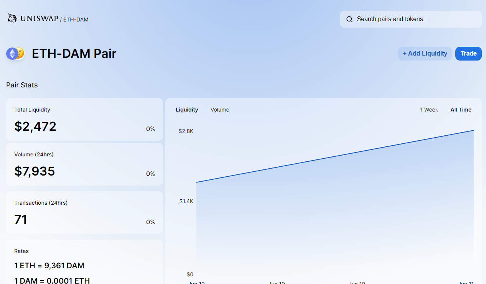
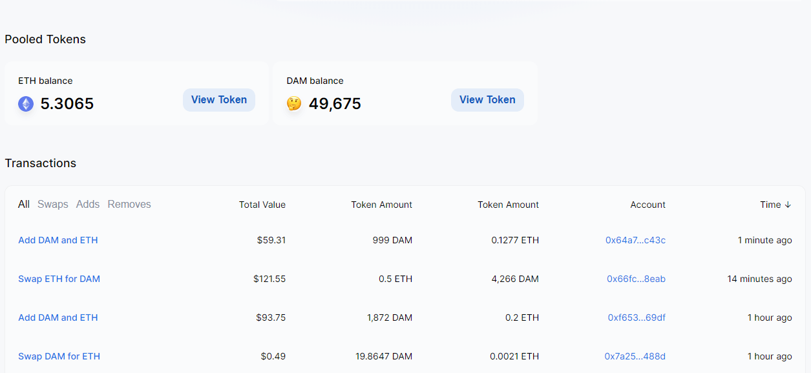

This guide explains how to add liquidity to Uniswap pools, focusing on the ETH-DAM pair. By providing liquidity, you can earn fees from trading activity on the platform.

Liquidity pools are collections of tokens locked in a smart contract, facilitating decentralized trading. When you deposit an equivalent value of two tokens (e.g., ETH and DAM) into a pool, you become a liquidity provider (LP) and receive liquidity tokens representing your share of the pool.

Liquidity providers earn a portion of the trading fees generated by swaps within the pool. On Uniswap, a 1.00% flat fee is charged for ERC-20 token trades, which is then distributed proportionally among LPs. These fees are automatically reinvested into the pool until collected.

When users trade tokens, your pooled assets may shift in ratio. For example, if more users buy DAM with ETH, your ETH holdings in the pool might decrease while your DAM holdings increase. This is a dynamic process reflecting market demand.

**Can one of my assets disappear entirely if I provide liquidity?**

No. When you supply a pair (e.g., DAM/ETH), you receive a liquidity token for that specific pool. People trade with the pool itself, not directly with your deposited tokens. Your liquidity token allows you to withdraw a ratio of ETH and DAM from the pool in the future. While this ratio can change with market dynamics, your assets will not disappear. You will also continue to benefit from collecting swap fees.

For a more technical explanation, we recommend reading: [A Graphical Guide for Understanding Uniswap](https://docs.ethhub.io/guides/graphical-guide-for-understanding-uniswap/)

# Step 1: Add Liquidity to the ETH-DAM Pair
Click on "+ Add Liquidity" to begin. (Note: This step is optional. If you want to learn about swapping tokens instead, skip to Step 4).

# Step 2: Enter Token Amounts
To add liquidity, you must have both ETH and DAM tokens in your wallet. You cannot add liquidity with only one of the assets.

You can quickly determine the maximum amount of DAM or ETH you can add by clicking the "MAX" button. The equivalent amount of the other token will be calculated based on the current market price. If you don't have enough of one asset, you can use the "MAX" button for the other, or enter custom values.

# Step 3: Confirm Liquidity Provision
Confirm the liquidity provision. In the example below, 495 DAM and 0.053 ETH are being added to the ETH-DAM Uniswap Liquidity pool. Follow the instructions in your MetaMask wallet to confirm the transaction.

Your transaction will be submitted after confirmation in MetaMask.

The transaction will initially show as pending and then confirm.

You can view your pooled liquidity by visiting: [uniswap.exchange/pool](https://uniswap.exchange/pool)

You can add or remove your pooled ETH/DAM tokens at any time. Congratulations, you are now a **Uniswap liquidity provider** and will **passively earn exchange fees (1.00%)** for every swap transaction involving DAM.

# Step 4: Swapping DAM Tokens
To swap DAM tokens, ensure you are on: [uniswap.exchange/swap](https://uniswap.exchange/swap)

This menu allows you to swap DAM for any ERC-20 token, and vice-versa. Calculations are based on the current market price.

